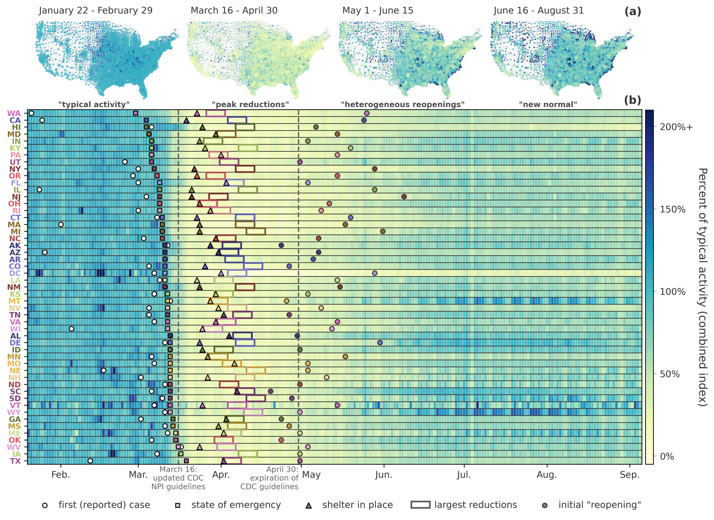

# COVID-19 and mobility patterns in the United States

Python code for reproducing the figures and analyses from the recent paper:

Klein, B., LaRock, T., McCabe, S., Torres, L., Friedland, L., Kos, M., Privitera, F., Lake, B., Kraemer, M.U.G., Brownstein, J.S., Gonzalez, R., Lazer, D., Eliassi-Rad, T., Scarpino, S.V., Vespignani, A., & Chinazzi, M. (2024). __Characterizing the collective physical distancing of the United States during the first nine months of the COVID-19 pandemic__. PLOS Digital Health 3(2): e0000430. https://doi.org/10.1371/journal.pdig.0000430

## Data and findings

The mobility, commuting, and contact indexes introduced in this publication are accessible at the following live dashboard: https://covid19.gleamproject.org/mobility. Cuebiq raw data are available upon request to Cuebiq's *Spectus Social Impact* program (https://spectus.ai/social-impact/). Through this, Cuebiq provided access to aggregated and privacy-enhanced mobility data for academic research and humanitarian initiatives. These first-party data are collected from anonymized users who have opted in to provide access to their GPS location data anonymously, through a GDPR-compliant framework. Additionally, Cuebiq provides an estimate of home and work census areas for each user. In order to preserve privacy, noise is added to these "personal areas", by upleveling these areas to the Census Block Group Level. This allows for demographic analysis while obfuscating the true home location of anonymous users and prohibiting misuse of data.

- - - -

<p align="center">

</p>

### Requirements  <a name="requirements"/>

This code is written in [Python 3.x](https://www.python.org) and uses the following packages:

* [Pandas](https://pandas.pydata.org/)
* [Numpy & Scipy](http://numpy.scipy.org/)
* [matplotlib](https://matplotlib.org)
* [geopandas](https://geopandas.org/) (for replicating the map figures)


## Citation   <a name="citation"/>

If you use findings from this work and/or some of the aggregated data provided in your own research, please cite the following:

Bibtex: 
```text
@article{Klein2024characterizing,
    title = {{Characterizing the collective physical distancing of the U.S.~during the first nine months of the COVID-19 pandemic}},
    author = {Brennan Klein and Timothy LaRock and Stefan McCabe and Leo Torres and Lisa Friedland and Maciej Kos and Filippo Privitera and Brennan Lake and Moritz U.G. Kraemer and John S. Brownstein and Richard Gonzalez and David Lazer and Tina Eliassi-Rad and Samuel V. Scarpino and Alessandro Vespignani and Matteo Chinazzi},
    year = {2024},
    journal = {PLOS Digital Health},
    doi = {}
}
```
